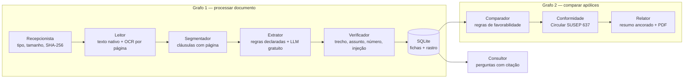

# PRISMA D&O — análise e comparação de apólices D&O com evidência verificada

**Projeto Final do InsurMinds (I2A2).** Plataforma que lê apólices de seguro D&O (Responsabilidade Civil
de Diretores e Administradores) em PDF digital, PDF escaneado ou imagem; extrai 36 campos com o **trecho
literal e a página** de onde cada valor saiu; confere automaticamente cada evidência; compara duas ou
mais apólices campo a campo com **regras de favorabilidade declaradas**; aponta indícios de
desconformidade com a **Circular SUSEP nº 637/2021**; responde perguntas com citação; e gera o
relatório comparativo em PDF.

> Apoio à decisão: o sistema compara o **texto** das apólices. Não recomenda contratação nem afirma que
> um sinistro concreto está coberto.

**O princípio que guia tudo:** nenhum valor aparece na tela sem um trecho que exista na página citada.
O LLM lê e redige; o código confere, normaliza, compara e decide.

---

## Sumário
- [Arquitetura](#arquitetura)
- [Os agentes](#os-agentes)
- [Resultados medidos](#resultados-medidos)
- [Instalação](#instalação)
- [Execução](#execução)
- [Estrutura do repositório](#estrutura-do-repositório)
- [Tecnologias](#tecnologias)
- [Segurança](#segurança)
- [Limitações conhecidas](#limitações-conhecidas)
- [Entregáveis](#entregáveis)
- [Integrantes](#integrantes)
- [Fontes](#fontes)
- [Licença](#licença)

## Arquitetura



Os dois grafos são `StateGraph` do **LangGraph**, com um nó por agente e um registro no rastro (tabela
`rastro`) por passo. Etapas do edital cobertas: recebimento → extração → organização → armazenamento →
consulta → comparação → apresentação.

## Os agentes

| Agente | O que faz | Onde |
|---|---|---|
| **Recepcionista** | Valida o tipo pela assinatura de bytes (não pela extensão), limita 25 MB e 150 páginas, calcula SHA-256, detecta documento fictício | `prisma/agentes/recepcionista.py` |
| **Leitor** | Texto nativo por página; página sem texto vai para OCR (RapidOCR, gratuito e offline); remove cabeçalho e rodapé repetidos | `prisma/agentes/leitor.py` |
| **Segmentador** | Reconhece 4 estilos de título de apólice brasileira, ignora o índice, guarda a página de cada linha | `prisma/agentes/segmentador.py` |
| **Extrator** | Dois caminhos com o mesmo contrato de saída: regras declaradas (`dados/extracao_deterministica.yaml`) e LLM em cascata gratuita sobre as cláusulas recuperadas por BM25 | `prisma/agentes/extrator.py` |
| **Verificador** | Aprova um valor só se o trecho existe na página (≥ 0,90 de similaridade), fala do assunto do campo, contém o número extraído e não é instrução dirigida a IA | `prisma/agentes/verificador.py` |
| **Comparador** | Aplica `dados/regras_comparacao.yaml` (37 regras) aos valores verificados: mais favorável, menos favorável, intermediária, equivalente | `prisma/agentes/comparador.py` |
| **Conformidade** | Aplica `dados/regras_susep.yaml` (11 regras, cada uma com o trecho literal do artigo) | `prisma/agentes/conformidade.py` |
| **Relator** | Resumo executivo ancorado (valor fora do quadro ou recomendação ⇒ resumo determinístico) e PDF comparativo com anexo de evidências | `prisma/agentes/relator.py` |
| **Consultor** | Pergunta livre → recuperação → resposta com citações conferidas; sem citação válida, "não localizado" | `prisma/agentes/consultor.py` |

**Esquema D&O** (`dados/campos.yaml`): 36 campos em 6 grupos — identificação; limites, franquia e
prêmio; gatilho temporal (base de contratação, retroatividade, prazos adicionais); coberturas (A, B, C,
penhora online, multas, investigação, herdeiros, ambiental, trabalhista, crise, extradição); exclusões
(dolo e seu gatilho, insolvência, danos corporais, fatos anteriores, cibernética, tributária); âmbito
geográfico, sub-rogação e adequação à Lei 15.040/2024.

## Resultados medidos

<!-- RESULTADOS:INICIO -->
Acurácia de extração contra o gabarito anotado. Conta como resposta só o valor **verificado** (o que o usuário veria na tela). "Errados exibidos" = valor verificado mas diferente do gabarito.

| Conjunto | Sem chave (regras) | Errados exibidos | Híbrido (LLM + regras) | Errados exibidos |
|---|---|---|---|---|
| Conjunto de desenvolvimento | 97.8% (218/223) | 0 | 98.7% (220/223) | 1 |
| **Holdout** (documentos nunca vistos) | 75.9% (44/58) | 1 | 79.3% (46/58) | 4 |
| ↳ especificações (PDF digital, escaneado, PNG) | 100.0% (78/78) | 0 | 100.0% (78/78) | 0 |
| ↳ condições gerais reais | 96.5% (140/145) | 0 | 97.9% (142/145) | 1 |

Gabarito: **281 campos** em 10 documentos. O holdout (Sompo e Chubb Capital Fechado) foi anotado antes de rodar o extrator e nenhuma regra de extração foi ajustada depois dele. Ressalva: a correção da fusão LLM + regras (docs/DESVIOS.md, D9) foi feita depois de analisar erros que incluíam o holdout; leia o número do híbrido no holdout com essa ressalva.

**OCR (RapidOCR)** em 7 páginas: CER alinhado por linha médio **0.03%** (máximo 0.10%); CER da página inteira, que também pune diferença de ordem de leitura, até 5.5%.
<!-- RESULTADOS:FIM -->

Como reproduzir: `python -m prisma.cli avaliar --modo deterministico --ocr` e
`python -m prisma.cli avaliar --modo hibrido`. Regras de pontuação em `prisma/avaliacao.py`.

## Instalação

Requisitos: Python 3.11+ (testado em 3.12). Nenhum binário de sistema (sem Tesseract, sem Poppler).

```bash
git clone <URL-DO-REPOSITORIO>
cd prisma_do
python -m venv .venv
.venv\Scripts\activate          # Windows  (Linux/macOS: source .venv/bin/activate)
pip install -r requirements.txt
```

Para o modo híbrido (LLM gratuito), instale também:

```bash
pip install langchain-core langchain-google-genai langchain-groq langchain-nvidia-ai-endpoints
```

e copie `.env.example` para `.env` com **ao menos uma** chave gratuita (Gemini, Groq ou NVIDIA).
Sem chave nenhuma, tudo funciona no modo determinístico.

Na primeira leitura com OCR, o RapidOCR baixa os modelos ONNX (~15 MB).

## Execução

```bash
# 1. baixar as condições gerais públicas (URLs oficiais, SHA-256 conferido)
python -m prisma.cli baixar-corpus

# 2. demonstração completa: processa o corpus e gera 3 relatórios comparativos em saida/
python -m prisma.cli demo            # use --sem-llm para forçar o modo determinístico

# 3. interface
streamlit run streamlit_app.py
```

Outros comandos:

```bash
python -m prisma.cli processar minha_apolice.pdf foto_da_especificacao.jpg
python -m prisma.cli comparar apolices/sinteticas/especificacao_aurora.pdf apolices/sinteticas/especificacao_cruzeiro.png
python -m prisma.cli perguntar "A apólice cobre penhora online?" apolices/reais/chubb_do_capital_aberto.pdf
python -m prisma.cli rastro
python -m pytest                      # testes (use -m "not lento" para pular o OCR real)
python scripts/gerar_sinteticas.py    # regenera as especificações fictícias e seus gabaritos
```

## Estrutura do repositório

```
prisma/                 código (agentes, grafo, armazém, CLI)
  agentes/              recepcionista, leitor, segmentador, extrator, verificador,
                        comparador, conformidade, relator, consultor
dados/                  regras declaradas: campos, extração, favorabilidade, SUSEP
apolices/reais/         fontes.yaml (PDFs baixados, fora do git)
apolices/sinteticas/    especificações FICTÍCIAS + PDF de teste de injeção de prompt
gabarito/               valores anotados (desenvolvimento) e gabarito/holdout/
testes/                 pytest
scripts/                geração do corpus sintético, relatório técnico, pitch, empacotamento
docs/                   DESVIOS.md (decisões e mudanças de rota)
Projeto_Final_Artefatos/  relatório técnico, pitch deck, vídeo, amostras
streamlit_app.py        interface
```

## Tecnologias

| Tecnologia | Por que |
|---|---|
| Python 3.12 | linguagem do curso; ecossistema de IA |
| LangGraph | grafo de estado explícito, um nó por agente, rastro por passo |
| PyMuPDF | texto por página e renderização para OCR, sem dependência de sistema |
| RapidOCR (PP-OCR em ONNX) | OCR gratuito e offline; CER medido de 0,03% por linha |
| Gemini / Groq / NVIDIA NIM (tier gratuito) | LLM em cascata com failover em voo; nenhum custo |
| Pydantic | contratos de dados entre agentes |
| rank-bm25 | recuperação local de cláusulas, sem embeddings pagos |
| SQLite + FTS5 | armazenamento estruturado e busca textual sem servidor |
| reportlab | relatórios em PDF |
| Streamlit | interface de demonstração |

## Segurança

- Upload: tipo validado por assinatura de bytes, limite de tamanho e de páginas, nome sanitizado.
- **Injeção de prompt**: o texto da apólice entra no prompt delimitado como dado; o Verificador reprova
  trecho com instrução dirigida a IA. Teste com 15 payloads plantados (`apolices/sinteticas/injecao_prompt.pdf`):
  nenhum valor exibido alterado; 0 falso positivo em 13.492 janelas de texto real.
- Favorabilidade nunca é decidida pelo LLM (regras em YAML).
- Texto de documento e de LLM é escapado antes de ir para a tela.
- Busca FTS5 com termos entre aspas (nenhum caractere do usuário vira operador).
- Chaves só em `.env` (fora do git); o sistema não exige chave.

## Limitações conhecidas

- As regras do modo determinístico foram escritas sobre as seguradoras do conjunto de desenvolvimento;
  em seguradora nova a acurácia sem LLM cai (ver holdout). O LLM é o que generaliza.
- Condições gerais trazem regras, não números: LMG, franquia e datas vêm da especificação da apólice,
  que é privada. Por isso as especificações da demonstração são fictícias.
- "Não localizado" pode significar que a informação está em outro documento da apólice (condições
  especiais separadas, endossos). O alerta de conformidade por ausência avisa isso.
- Favorabilidade é por campo, com regras gerais de mercado; não pondera o perfil de risco do tomador.
- Provedores gratuitos de LLM têm cota e instabilidade; a cascata e o modo determinístico cobrem, mas a
  latência varia.
- A conformidade aponta indícios para revisão humana; não é parecer jurídico.

## Entregáveis

Na pasta [`Projeto_Final_Artefatos/`](Projeto_Final_Artefatos/):
`Relatorio_Tecnico_PRISMA_DO.pdf` · `InsurMinds_Projeto_Final.pptx` · `InsurMinds_Projeto_Final.mp4` ·
`Relatorio_Comparativo_Exemplo_Ficticio.pdf` (três cotações fictícias, gerado sem chave de API) · `telas/`.
Roteiro sugerido para o vídeo: [`docs/roteiro_video.md`](docs/roteiro_video.md).

## Integrantes

<!-- INTEGRANTES:INICIO -->
_A preencher pelo grupo: nome do grupo, representante e integrantes._
<!-- INTEGRANTES:FIM -->

## Fontes

- Circular SUSEP nº 637, de 27/07/2021 (seguros do grupo responsabilidades).
- Lei nº 15.040/2024 (Lei de Seguros).
- Condições gerais públicas de RC D&O: Chubb (Capital Aberto e Capital Fechado), Berkley (duas versões),
  Essor (Grupo SCOR), Argo e Sompo — URLs e hashes em `apolices/reais/fontes.yaml`.
- Referencial de comparação de apólices D&O: pesquisa com 111 fontes (NotebookLM), incluindo notas de
  Demarest e Poletto & Possamai sobre a Circular 637 e artigos do ConJur sobre o seguro D&O.
- Avaliação de extração jurídica: CUAD (Hendrycks et al., 2021) e ContractEval (arXiv 2508.03080).

## Licença

[MIT](LICENSE).
